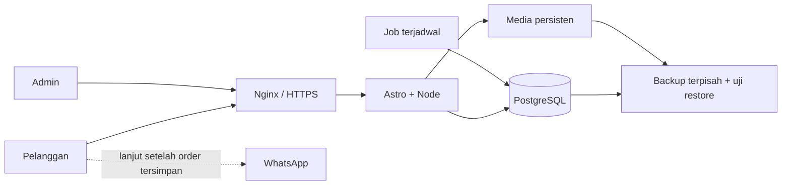

# Pilihan arsitektur — fase 4A

Keputusan rancangan teknis, belum pemasangan paket/migrasi. Pilihan ini mempertahankan
project yang ada dan mengutamakan satu deployment yang mudah dioperasikan.

## Aplikasi dan database

**Astro + adapter Node standalone**, satu origin untuk website, admin, dan endpoint.
Adapter mendukung rute yang dirender server; mode standalone menyediakan entry server.
Ini memungkinkan kelanjutan project saat ini. [Dokumentasi Node Astro](https://docs.astro.build/en/guides/integrations-guide/node/).

Data jadwal/booking diambil server pada request, sehingga perubahan admin tidak
menunggu rebuild. Aset CSS/font dan media publik tetap dapat di-cache. Konten Home
yang memuat harga/jadwal harus ikut memakai data server atau mekanisme invalidasi
yang eksplisit; jangan diam-diam mengandalkan data statis lama.

**PostgreSQL**, dipilih karena transaksi, constraint relasional, serta penguncian
row cocok untuk rancangan alokasi kursi. Semua penulis kuota harus mengikuti protokol
lock yang sama; memakai PostgreSQL saja tidak otomatis mencegah overselling.
Mekanisme lock tersedia pada [dokumentasi PostgreSQL](https://www.postgresql.org/docs/current/explicit-locking.html).

**Drizzle ORM + postgres.js**, dengan migrasi SQL yang direview dan dijalankan saat
deploy. Drizzle mendukung PostgreSQL melalui driver ini; schema aplikasi ditulis
TypeScript. [Dokumentasi Drizzle](https://orm.drizzle.team/docs/get-started/postgresql-new).
Gunakan rilis stabil dan lockfile; panduan terbaru dapat menampilkan contoh RC,
sehingga jangan menyalin perintah prerelease tanpa kebutuhan.

## Login admin

**Better Auth**, integrasi Astro melalui handler auth dan middleware pemeriksaan
sesi. Library menyediakan jalur integrasi Astro dan adapter Drizzle.
[Integrasi Astro](https://better-auth.com/docs/integrations/astro),
[adapter Drizzle](https://better-auth.com/docs/adapters/drizzle).

Rancangan aplikasi: email/password admin, signup publik dinonaktifkan, admin pertama
dibuat lewat prosedur bootstrap aman pada 4B, dan admin berikutnya dibuat oleh admin
aktif melalui Management Akun. Membership admin diperiksa di setiap
mutation/halaman sensitif, bukan hanya menyembunyikan menu. Cookies secure/httpOnly
di produksi, CSRF/origin checks, sesi persisten, serta pencabutan akses staf wajib
dikonfigurasi dan diuji pada implementasi. Tidak ada password default dalam source.

Schema auth dihasilkan dari konfigurasi library yang dipakai; sesi admin tidak
digandakan dalam mekanisme Astro session lain. UI dapat memakai client vanilla,
tanpa harus menambah framework frontend untuk login.

## Media, job, dan operasi VPS

Usulan deployment awal satu VPS: Nginx/aaPanel reverse proxy → proses Node terkelola →
PostgreSQL. Media tersimpan di direktori persisten di luar folder rilis. Foto publik
dan bukti pembayaran privat dipisah; bukti hanya dilayani endpoint setelah pemeriksaan
akses. Cadangkan DB dan media bersama metadata yang menghubungkannya.

Expiry dan outbox memakai perintah job terjadwal melalui systemd timer/cron pada
server, bukan timer pada browser. Proses harus idempotent; lock mencegah tumpang
tindih. Booking baru tetap melakukan cleanup due holds untuk keberangkatan terkait
jika scheduler terlambat. Interval usulan job satu menit; detail waktu kebijakan tetap D03–D05.

Backup DB memakai dump yang dapat direstore; jadwalkan backup media, enkripsi/akses,
salinan terpisah dari VPS, retensi, serta uji pemulihan sebelum live. PostgreSQL
menjelaskan alur dump/restore pada [panduan backup](https://www.postgresql.org/docs/18/backup-dump.html).
Target kehilangan data maksimal (RPO), waktu pulih (RTO), kapasitas disk, dan jadwal
backup disepakati dengan pemilik saat lingkungan diketahui. Rollback schema tidak
dilakukan otomatis dengan menghapus data booking.

Redis, worker service terpisah, dan object storage eksternal belum diperlukan untuk
rancangan satu instance. Jika pindah multi-instance, strategi media/rate limit/job
harus diperiksa ulang. Tidak ada jaminan performa VPS sebelum kapasitasnya diketahui.

## Bukti kompatibilitas dan batas verifikasi

Pemeriksaan pada sesi 4A:

- Project memakai Astro 7.3.2; Node lokal 24.11.1.
- Registry mengembalikan `@astrojs/node` 11.1.5 dengan peer `astro: ^7.2.1`,
  sehingga rentang peer mencakup Astro project.
- Registry saat diperiksa: Better Auth 1.7.4, Drizzle ORM 0.45.2, postgres.js 3.4.9.
- Integrasi Astro/Better Auth/Drizzle terdokumentasi pada sumber di atas.

Ini bukti dokumentasi dan metadata, **bukan bukti seluruh kombinasi sudah berjalan**.
Tidak ada paket operasional yang di-install di 4A. Pada 4B, lakukan pemasangan terkunci,
generate schema auth, uji migrasi, login/logout, restart, query DB, dan build Node.
Versi PostgreSQL dipilih dari versi yang didukung server dengan patch terkini;
konfirmasi ketersediaan pada target VPS/aaPanel sebelum provision.
