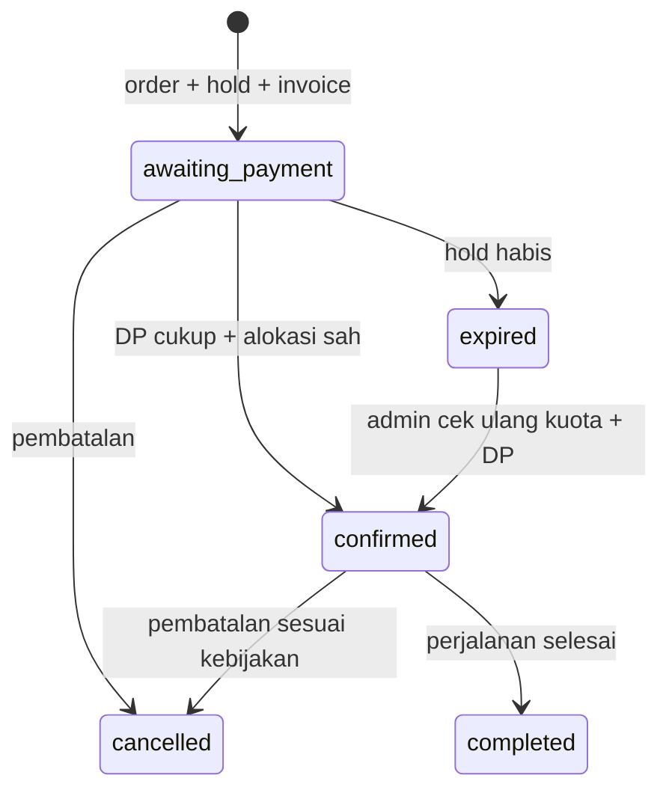

# Aturan dan skenario booking — 4A

Status keputusan mengikuti [register D01–D14](README.md). Keputusan kritis D01–D03,
D05, D08 sudah ditetapkan dan dicatat di sini. Keputusan terbuka lainnya mengikuti
fase terkait. Angka contoh semata-mata untuk simulasi.

## Perhitungan rupiah

- Semua nominal IDR berupa integer rupiah. Database `bigint`; perhitungan server
  memakai integer/BigInt. JSON mengirim nominal sebagai string desimal, bukan float.
- Contoh harga tunggal: `total = harga_per_pax × pax`, pax bilangan bulat positif.
  Harga untuk varian/anak/biaya tambahan menunggu D06; jangan menambahkan biaya diam-diam.
- Persentase disimpan dalam basis point: 30% = 3000, 100% = 10000.
- Usulan pembulatan DP persentase ke atas: `(total × bps + 9999) / 10000`, integer division.
- DP nominal berlaku per total order (D02 diputuskan): DP Rp3 juta berarti Rp3 juta
  untuk keseluruhan booking, bukan per pax. Nilai harus positif dan tidak lebih besar dari total.
  Persentase harus > 0 dan ≤ 100%. Promo DP nol belum termasuk rancangan MVP.
- `sisa = max(total - terbayar_net, 0)`; `kelebihan = max(terbayar_net - total, 0)`.
  Kelebihan bayar dicatat untuk tindak lanjut, bukan menghilang atau menambah pax.
- `kekurangan_dp = max(dp_minimum - terbayar_net, 0)`. Bukti pending/ditolak tidak
  menambah terbayar. Reversal pembayaran salah mengurangi nilai efektif pembayaran.
- Snapshot harga, basis DP, fasilitas, ketentuan, dan tenggat tersimpan di order;
  perubahan master hanya berlaku bagi order berikutnya. Perubahan kontrak order lama
  memerlukan versi penyesuaian terpisah, alasan, serta pencatatan kesepakatan.

Contoh: Rp2.500.000 × 4 pax = Rp10.000.000, DP 30% = Rp3.000.000, sisa setelah DP
diterima = Rp7.000.000. Rp333.333 × 10% menjadi Rp33.334 menurut usulan pembulatan.

## Empat hal yang berbeda

| Dimensi           | Nilai rancangan                                                | Fungsi                                             |
| ----------------- | -------------------------------------------------------------- | -------------------------------------------------- |
| Pembayaran        | unpaid / dp / paid                                             | Dihitung dari tagihan aktif dan pembayaran efektif |
| Pemeriksaan bukti | pending / accepted / rejected                                  | Keputusan atas bukti; bukan status booking         |
| Booking           | awaiting_payment / confirmed / expired / cancelled / completed | Siklus pesanan                                     |
| Alokasi kursi     | held / committed / released                                    | Penggunaan kapasitas keberangkatan                 |

Refund adalah penyelesaian tersendiri terhadap order yang dibatalkan, dengan nominal
yang diotorisasi pemilik. Status Unpaid/DP/Paid menunjukkan pemenuhan tagihan, bukan
status refund. Pada invoice cancelled tampilkan label pembatalan/refund secara menonjol,
riwayat penerimaan, serta pengembalian; sembunyikan ajakan membayar. Jangan mengubah
refund menjadi “pelanggan belum bayar”. Refund yang belum diselesaikan tidak boleh
ditandai selesai hanya karena permintaan dibuat. Koreksi pembukuan berbeda dari refund.

## Transisi yang diperbolehkan

| Kejadian                        | Dari → ke                              | Syarat dan efek                                                             |
| ------------------------------- | -------------------------------------- | --------------------------------------------------------------------------- |
| Order dibuat                    | — → awaiting_payment                   | Simpan invoice dan held seat dalam transaksi yang sama                      |
| Bukti diunggah                  | booking tetap                          | Tambah submission pending; tidak membuat pembayaran diterima                |
| Nominal diterima kurang dari DP | awaiting_payment tetap                 | Payment status DP, kursi tetap held hingga tenggat yang sah                 |
| DP minimum diterima             | awaiting_payment → confirmed           | Belum expired/cancelled, alokasi valid, DP terpenuhi; held → committed      |
| Pelunasan diterima              | confirmed tetap                        | Payment status paid; jangan membuat alokasi kedua                           |
| Langsung lunas                  | awaiting_payment → confirmed           | Syarat alokasi sama; payment status paid                                    |
| Masa hold habis                 | awaiting_payment → expired             | Tanpa pengecualian review yang sah; held → released tepat sekali            |
| Bayar setelah expiry            | expired tetap                          | Catat penerimaan, tandai perlu rekonsiliasi; tidak mengambil kursi otomatis |
| Admin setujui pemulihan         | expired → confirmed                    | DP sah, cek ulang kapasitas atomik, alasan dan audit wajib                  |
| Pembatalan                      | awaiting_payment/confirmed → cancelled | Kebijakan D08; release satu kali, refund ditangani terpisah                 |
| Trip selesai                    | confirmed → completed                  | Setelah akhir perjalanan dan pengecekan admin                               |

Koreksi pembayaran pada order confirmed tidak otomatis melepas kursi atau
membatalkan perjalanan; tandai kekurangan pembayaran untuk admin dan audit perubahan.
Order completed tidak diedit statusnya secara bebas untuk menyamarkan riwayat.

## Kuota, tanggal, dan tenggat

- Trip mempunyai beberapa departure. Kapasitas dijaga per departure, bukan per nama destinasi.
- `tersedia = capacity - SUM(pax alokasi held/committed yang masih berlaku)`.
- Semua perubahan alokasi mengunci row departure terlebih dahulu; lock order konsisten:
  departure → booking → invoice → submission/ledger. Private tanpa departure mulai di booking.
- Harga/DP/order dan kuota diperiksa ulang ketika commit. Lock tidak ditahan selama
  menunggu upload, panggilan jaringan, atau tindakan pelanggan.
- Cleanup expiry wajib memakai transaksi dan lock yang sama. Jika job terlambat,
  booking baru menjalankan cleanup due holds pada departure tersebut sebelum menghitung kuota.
- Hasil availability di layar informatif; submit terakhir tetap dapat gagal karena kuota habis.
- Batas hold aktual tidak boleh melampaui booking cutoff; cutoff tidak boleh sesudah keberangkatan.
- Waktu operasional disimpan sebagai `timestamptz` UTC. Tampilan memakai zona departure,
  misalnya `Asia/Makassar` untuk Labuan Bajo dan `Asia/Jakarta` untuk Jawa.
  Tanggal liburan dari request private boleh berupa tanggal lokal tanpa jam dahulu.
- `hold_expires_at`, `review_until`, `balance_due_at`, dan `booking_cutoff_at`
  memiliki fungsi berbeda. `hold_expires_at = created_at + 24 jam`, dipotong
  `booking_cutoff_at` departure (D03 diputuskan). `balance_due_at` diatur admin
  per departure. Nilai `review_until` menunggu D04.
- D04: bukti pending tidak menahan selamanya. Usulan grace terbatas dan hanya untuk
  submission pertama yang masuk tepat waktu; unggah berulang tidak memperpanjang.
  Detail durasi dan perilaku setelah review berakhir menunggu keputusan pada 4E.

## Request Private Trip

`new → discussing → quoted → agreed → converted`; jalur `declined/expired` tersedia.
Penawaran punya versi immutable, jumlah pax, paket, harga total/line items, DP,
tanggal, masa berlaku, dan bukti/catatan persetujuan. Revisi membuat versi baru.
Konversi hanya versi disepakati yang masih berlaku; request/quote hanya dikonversi
sekali. Admin manual dapat mencatat penawaran dan persetujuan dari WhatsApp sebelum
membuat order. Booking private tidak mengurangi kuota open trip secara implisit.

## Skenario penerimaan untuk fase 4E–4G

| ID  | Skenario                                        | Hasil yang harus dibuktikan saat implementasi                                  |
| --- | ----------------------------------------------- | ------------------------------------------------------------------------------ |
| T01 | 4 pax × Rp2,5 juta, DP 30%                      | Total Rp10 juta, DP Rp3 juta                                                   |
| T02 | DP nominal Rp1 juta, 4 pax                      | Rp1 juta untuk keseluruhan order (D02: per total order)                        |
| T03 | DP persentase pecahan                           | Pembulatan integer konsisten di quote/order/invoice                            |
| T04 | Browser mengirim harga murah                    | Server abaikan harga dan gunakan quote/master yang sah                         |
| T05 | Harga berubah sesudah ringkasan                 | Minta konfirmasi quote baru; tidak menagih perubahan diam-diam                 |
| T06 | 2 pembeli berebut 1 kursi                       | Hanya satu transaksi berhasil                                                  |
| T07 | Klik ganda / retry timeout                      | Idempotency yang sama menghasilkan order yang sama                             |
| T08 | Bukti pending atau ditolak                      | Total terbayar tidak berubah                                                   |
| T09 | Rp1 juta diterima, DP minimum Rp3 juta          | DP, kekurangan Rp2 juta, booking belum confirmed                               |
| T10 | DP cukup lalu lunas                             | Satu invoice; committed seats tidak bertambah lagi                             |
| T11 | Admin/gateway memproses bukti sama dua kali     | Satu penerimaan efektif; operasi lain mengembalikan hasil yang sama            |
| T12 | Expiry berlomba dengan verifikasi               | Lock/cek deadline menentukan hasil; tidak ada kursi ganda                      |
| T13 | Transfer diterima sesudah expiry                | Catat uang; rekonsiliasi tanpa auto mengambil kursi                            |
| T14 | WA gagal dibuka                                 | Order tetap ada, dapat dicari admin                                            |
| T15 | Menebak nomor invoice / mencoba aksi pembayaran | Invoice dapat dibaca; unggah dan submit pembayaran tetap membutuhkan grant sah |
| T16 | Master trip diedit                              | Invoice lama menampilkan snapshot lama                                         |
| T17 | Konversi quote private dua kali                 | Satu booking/invoice                                                           |
| T18 | Kelebihan, refund, atau reversal                | Riwayat tetap, total/label jelas, tanpa penghapusan pembayaran                 |

T01–T03 dan visual status dapat dicoba pada prototipe. T04–T18 masih kriteria masa
depan; simulasi di browser bukan bukti bahwa database atau autentikasi sudah teruji.
