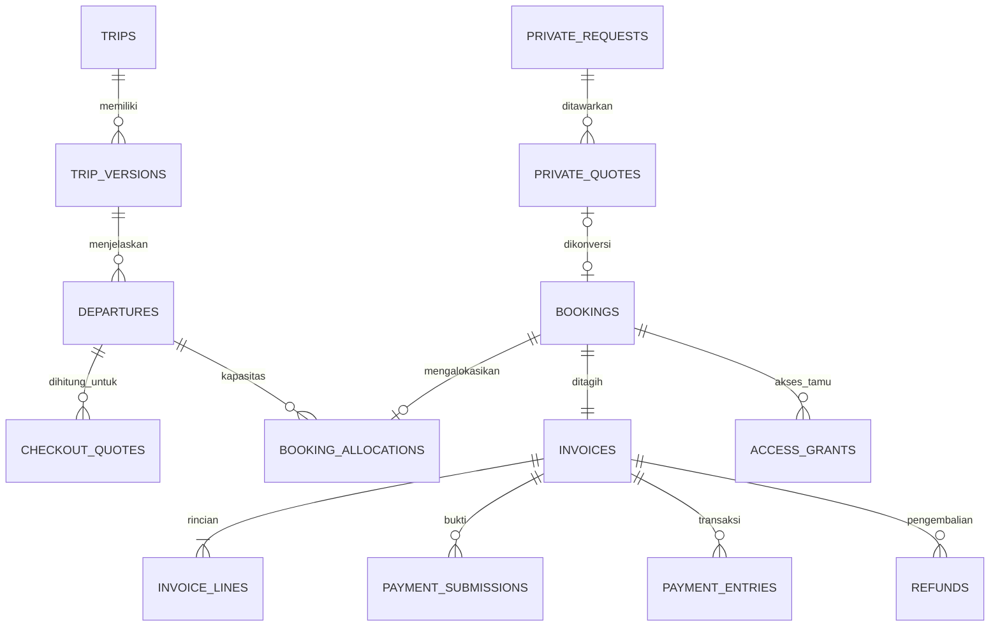

# Model data dan kontrak operasi — 4A

Ini rancangan logis PostgreSQL, **bukan migrasi yang dijalankan**. Nilai kebijakan
mengikuti [register keputusan](README.md); fixture prototipe tidak menjadi default database.

## Relasi inti

## Field dan constraint

Semua tabel bisnis memiliki ID internal UUID, waktu dibuat/diubah sesuai kebutuhan.
Nominal `bigint` rupiah, pax integer positif, referensi relasional berupa FK.
FK transaksi memakai RESTRICT/arsip, bukan cascade delete riwayat uang.

| Entitas                        | Field inti                                                                                                                                                                                  | Aturan penting                                                                                                            |
| ------------------------------ | ------------------------------------------------------------------------------------------------------------------------------------------------------------------------------------------- | ------------------------------------------------------------------------------------------------------------------------- |
| Auth (dikelola Better Auth)    | user, account, session, verification                                                                                                                                                        | Schema dihasilkan dari konfigurasi library pada 4B; tidak menduplikasi password/session custom                            |
| admin_memberships              | auth_user_id, role, active                                                                                                                                                                  | UNIQUE user; autentikasi saja tidak cukup tanpa membership admin aktif                                                    |
| trips                          | slug, name, category, archived_at                                                                                                                                                           | UNIQUE slug; arsip mempertahankan relasi historis                                                                         |
| trip_versions                  | trip_id, version, description, included, excluded, itinerary, preparation, meeting_point, terms, media_ids                                                                                  | UNIQUE trip+version; published version immutable; editor blok terstruktur/sanitized                                       |
| departures                     | trip_version_id, start_at, end_at, timezone, capacity, unit_price, dp_mode, dp_value, dp_basis, hold_duration, review_grace, balance_due_at, booking_cutoff_at, publication_state, revision | start < end, capacity ≥ 0, price > 0, DP valid; tidak dibuka tanpa konfigurasi kebijakan lengkap                          |
| checkout_quotes                | guest_session_hash, departure_id, departure_revision, pax, price_snapshot, dp_snapshot, package_snapshot, total, expires_at                                                                 | Server-generated, terikat sesi tamu; bukan alokasi kursi; quote berubah perlu review ulang                                |
| bookings                       | public_number, kind, departure_id?, private_quote_id?, pic_snapshot, pax, package_snapshot, policy_snapshot, state, hold_expires_at?, confirmed_at?, version                                | public_number UNIQUE; open wajib departure, private wajib agreed quote; sumber XOR; kutipan biaya immutable               |
| booking_allocations            | booking_id, departure_id, pax, state, expires_at?                                                                                                                                           | UNIQUE booking; held/committed/released; semua write mengunci departure yang sama                                         |
| invoices                       | booking_id, number, currency, total, minimum_dp, balance_due_at, issued_at, voided_at?                                                                                                      | UNIQUE booking dan number; IDR; total > 0; DP dalam (0,total]; nominal berasal dari server                                |
| invoice_lines                  | invoice_id, label, quantity, unit_amount, line_total                                                                                                                                        | line_total = quantity × unit_amount; sum = invoice.total diperiksa transaksi; contoh MVP satu baris pax                   |
| payment_submissions            | invoice_id, claimed_amount, received_at, media_id?, method, status, reviewed_by?, reviewed_at?, reason?                                                                                     | pending/accepted/rejected; klaim pelanggan belum pembayaran; review bersyarat hanya dari pending                          |
| payment_entries                | invoice_id, submission_id?, kind, amount, source_namespace, source_reference, reversal_of?, actor_id, created_at                                                                            | receipt/reversal, amount > 0; UNIQUE accepted submission dan sumber transaksi; append-only, reversal terkait receipt asli |
| refunds                        | invoice_id, amount, status, authorized_by, reason, settled_at?, external_reference?                                                                                                         | requested/authorized/settled/rejected; terpisah dari pembatalan dan reversal; maksimum menurut kebijakan/nilai tersedia   |
| private_requests               | reference, target_trip_id?, destination_text, requested_dates, duration?, pax, pic_snapshot, notes, state                                                                                   | Referensi UNIQUE; tanggal usulan bukan guaranteed availability                                                            |
| private_quotes                 | request_id, version, package_snapshot, price_lines, dp_snapshot, dates, pax, expires_at, agreed_at?, agreement_evidence?, state                                                             | UNIQUE request+version; satu versi aktif; hanya agreed dan berlaku dapat dikonversi; UNIQUE booking.private_quote_id      |
| guest_sessions / access_grants | token_hash, scope, booking_id?, expires_at, revoked_at?                                                                                                                                     | Token acak di klien, hash di DB; invoice terikat booking, scope baca/upload dipisahkan                                    |
| idempotency_records            | actor_or_guest_scope, operation, key, request_hash, resource_id, completed_at                                                                                                               | UNIQUE scope+operation+key; payload berbeda dengan key sama → konflik                                                     |
| media_assets                   | storage_key, mime, size, checksum, visibility, owner_scope                                                                                                                                  | Key acak; bukti private tidak dilayani folder public; metadata bukan izin akses                                           |
| audit_events                   | actor, action, entity_id, timestamp, redacted_diff, reason                                                                                                                                  | Append-only; tidak menyimpan password, token, atau isi bukti dalam log                                                    |
| notification_outbox            | event_id, booking_id, channel, state, attempts, next_attempt_at                                                                                                                             | UNIQUE event+channel; kanal belum dipilih, pengiriman di luar transaksi order                                             |

Peserta individu dan variasi kamar/anak bukan asumsi yang dipaksakan ke schema.
Field tersebut ditetapkan setelah D06/D09; `pic_snapshot` awal berisi data pemesan.
Galeri/artikel akan memakai pola media/version dengan tabel fase 4H, bukan blocker 4B.

Constraint lintas tabel (sum invoice, kapasitas, reversal kumulatif tidak melebihi
receipt, refund tidak melebihi nilai sah, dan relasi allocation-departure-booking)
dijaga dalam service transaksi. CHECK lokal saja tidak membuktikan invariant tersebut.
Balance/status pembayaran berupa proyeksi dari receipt minus reversal; refund dicatat
terpisah. Bila proyeksi disimpan untuk pencarian, perbarui dalam transaksi dan sediakan
rekonsiliasi terhadap ledger.

Index untuk daftar admin: booking `(state, created_at)`, nomor UNIQUE, normalized WA;
departure `(publication_state, start_at)`; allocation `(departure_id, state, expires_at)`;
submission `(status, received_at)`; job `(state, next_attempt_at)`. Data sensitif tidak
ditambahkan ke index publik/search engine.

## Kontrak endpoint rancangan

Path dapat disesuaikan saat 4B. Semua mutation memakai validasi schema server,
origin/CSRF protection, session sesuai scope, dan respons tanpa detail SQL/internal.

| Operasi                                    | Input utama                                                     | Hasil / akses                                                                         |
| ------------------------------------------ | --------------------------------------------------------------- | ------------------------------------------------------------------------------------- |
| GET /api/trips, /api/departures            | filter tanggal/jenis                                            | Data published saja; angka availability informatif                                    |
| POST /api/checkout/quote                   | departureId, pax                                                | Quote server: nominal string, DP, tenggat, revision, expiresAt; terikat guest session |
| POST /api/bookings                         | quoteId, PIC, termsVersion; header Idempotency-Key              | 201 bookingId/number + invoicePath setelah commit; guest session diberi grant order   |
| GET /invoice/:number                       | nomor invoice                                                   | Invoice Open Trip dapat dibaca langsung; Cache-Control private,no-store               |
| POST /api/invoice-access/exchange          | token undangan melalui body                                     | Tukar token terbatas menjadi cookie/grant invoice; tanpa token pada access log        |
| POST /api/bookings/:id/payment-submissions | claimedAmount, mediaId, reference                               | 202 pending, bukan Paid; harus punya scope order                                      |
| POST /api/admin/payments/:id/review        | accept/reject, actualAmount, reference, reason, expectedVersion | Hanya admin aktif; lock invoice/order/departure; ledger dan audit atomik              |
| POST /api/private-requests                 | dates, destination, pax, PIC, notes; idempotency key            | Request tersimpan dengan reference; belum invoice                                     |
| POST /api/admin/private-quotes/:id/convert | agreedVersion, evidence, expectedVersion                        | Order/invoice private sekali saja                                                     |
| POST /api/admin/departures                 | package, schedule, price, DP, capacity, deadlines               | Admin; publication ditolak bila konfigurasi belum lengkap                             |
| PATCH /api/admin/departures/:id            | changes, expectedVersion, reason                                | Konflik jika data sudah berubah; tidak mengubah snapshot order lama                   |

Browser tidak boleh menetapkan `total`, `paid`, `confirmed`, `capacity_remaining`, atau
`admin_role`. Invalid input → 422, harga/quote/kuota/version berubah → 409, sesi tidak
sah → 401/403 atau respons generik 404 pada sumber privat. Gagal simpan tidak pernah
menampilkan nomor invoice sukses. Rate limit relevan terutama quote, booking, upload,
auth, dan pertukaran token.

Grant token tetap memakai nilai acak kuat dengan expiry/revocation, tetapi sejak
Phase 4K hanya diperlukan untuk aksi pembayaran; pembacaan invoice dibuka
langsung melalui nomor invoice.
Usulan tautan menggunakan fragment yang ditukar lewat POST agar token tidak masuk
URL log server; hapus fragment sesudah tukar, tanpa third-party embed pada invoice,
Referrer-Policy no-referrer. Penyimpanan DB hanya hash. Kanal distribusi ulang D10
belum dipilih. Idempotency key bukan kredensial membaca order.

## Urutan transaksi Open Trip

1. Verifikasi guest session, idempotency scope/key, dan hash payload. Retry yang
   sah mengembalikan resource yang sama; key milik sesi lain tidak memberi akses.
2. Begin transaction, lock departure, lalu cleanup due holds yang relevan mengikuti
   urutan lock yang sama. Jangan melakukan akses jaringan di dalam lock.
3. Validasi quote masih berlaku, revision/paket sama, publication/cutoff/jumlah pax
   sah, dan hitung ulang harga/DP. Perbedaan memerlukan review quote baru.
4. Hitung kapasitas aktif setelah cleanup; jika kurang, rollback dan respons 409.
5. Buat booking + snapshot, satu allocation held, invoice+lines, guest access grant,
   audit, dan resource idempotency dalam transaksi. Nomor dari sequence server;
   celah nomor akibat rollback diperbolehkan, keunikan wajib.
6. Commit terlebih dahulu; baru kembalikan invoice dan tawaran membuka WhatsApp.
   Notifikasi otomatis kelak lewat outbox; gagalnya provider tidak rollback order.

Verifikasi pembayaran dan expiry mengambil lock departure → booking → invoice,
memeriksa waktu/status terbaru, lalu mengubah ledger/alokasi bersama-sama. Kondisi
retry deadlock/serialization ditangani terbatas dengan idempotency; jangan mengulang
pembayaran secara buta. Detail SQL dan pengujian konkurensi masuk fase 4E–4F.

## Batas versioning dan perubahan admin

- `expectedVersion` mencegah admin kedua menimpa edit tanpa mengetahui perubahan.
- Konten/jadwal yang sudah dipakai booking tidak dihapus cascade.
- Penawaran private direvisi sebagai versi baru; persetujuan melekat pada versi itu.
- Koreksi tagihan lama memerlukan catatan penyesuaian/revisi yang eksplisit setelah
  kebijakan D08 ditetapkan. MVP tidak menyediakan edit bebas nominal invoice terbit.
