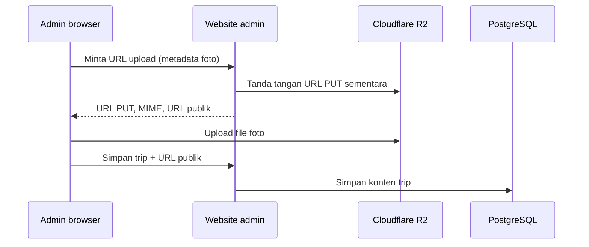

# Cloudflare R2 untuk media trip

Status: **integrasi upload cover trip tersedia di kode, belum aktif sampai R2
dikonfigurasi.** Dokumen ini adalah prosedur setup untuk fase 4C. Tidak ada
kredensial R2 di repository atau browser.

## Keputusan implementasi

Foto utama trip disimpan sebagai object publik pada bucket R2, sedangkan URL publiknya
disimpan pada field `trip_versions.cover_image_url`. Admin memilih JPEG, PNG, atau
WebP maksimal 8 MB; thumbnail muncul sebelum upload. Ketika admin menyimpan trip,
aplikasi membuat URL PUT R2 yang hanya berlaku lima menit. Browser mengunggah langsung
ke R2 memakai URL itu, lalu aplikasi menyimpan URL publik ke database.



Browser tidak menerima `R2_SECRET_ACCESS_KEY`. URL sementara dibatasi ke satu object,
satu MIME type, dan masa berlaku pendek. Access key juga hanya diberikan hak Object
Read & Write untuk bucket media, bukan hak akun Cloudflare umum.

R2 memiliki kompatibilitas S3; endpoint memakai pola
`https://<ACCOUNT_ID>.r2.cloudflarestorage.com` dan region `auto`.
[Dokumentasi S3 R2](https://developers.cloudflare.com/r2/get-started/s3/).

## Yang perlu disiapkan di Cloudflare

1. Buat bucket baru, contoh `lebihjauh-media`. Pisahkan dari bucket bukti pembayaran
   atau berkas pribadi yang akan hadir di fase pembayaran; foto trip publik dan bukti
   transfer tidak boleh satu bucket publik.
2. Hubungkan custom domain pada bucket, contoh `media.domain-anda.com`. Custom domain
   menjadi `R2_PUBLIC_BASE_URL`. URL `r2.dev` hanya dipakai development/non-production;
   Cloudflare merekomendasikan custom domain untuk produksi dan fitur cache/keamanan.
   [Dokumentasi public bucket](https://developers.cloudflare.com/r2/buckets/public-buckets/).
3. Di R2 → **Manage R2 API Tokens**, buat token S3 API dengan permission Object
   Read & Write yang dibatasi ke bucket tersebut. Simpan sekali saja Account ID,
   Access Key ID, Secret Access Key, dan endpoint yang ditampilkan Cloudflare.
4. Atur CORS bucket seperti contoh di bawah. Ganti domain dan IP dengan origin yang
   benar-benar dipakai admin. Untuk production, hapus origin LAN yang sudah tidak
   digunakan; jangan memakai `*`.

   ```json
   [
     {
       "AllowedOrigins": [
         "http://localhost:4321",
         "http://172.21.0.1:4321",
         "https://domain-anda.com"
       ],
       "AllowedMethods": ["PUT"],
       "AllowedHeaders": ["Content-Type"],
       "ExposeHeaders": ["ETag"],
       "MaxAgeSeconds": 3600
     }
   ]
   ```

   URL bertanda tangan tetap memerlukan CORS agar browser dapat upload langsung.
   [Dokumentasi CORS R2](https://developers.cloudflare.com/r2/buckets/cors/).

5. Aktifkan public access melalui custom domain untuk bucket ini saja. Jangan
   membuka bucket bukti pembayaran. Pasang cache rule untuk foto bila diperlukan;
   object cover baru memakai key unik agar perubahan foto tidak tertahan cache lama.
6. Aktifkan notifikasi/budget billing Cloudflare. R2 menyediakan free tier 10 GB-month
   storage, 1 juta Class A, dan 10 juta Class B request per bulan, tetapi operasi di
   atas free tier tetap berbiaya. Periksa harga terbaru sebelum produksi.
   [Harga R2](https://developers.cloudflare.com/r2/pricing/).

## Konfigurasi aplikasi

Isi `.env` server; contoh tanpa credential nyata ada di `.env.example`.

```dotenv
R2_ACCOUNT_ID=account_id_cloudflare
R2_ACCESS_KEY_ID=access_key_id_s3
R2_SECRET_ACCESS_KEY=secret_access_key_s3
R2_BUCKET_NAME=lebihjauh-media
R2_PUBLIC_BASE_URL=https://media.domain-anda.com
```

`R2_PUBLIC_BASE_URL` **bukan** endpoint S3 API yang berbentuk
`https://<ACCOUNT_ID>.r2.cloudflarestorage.com`. Endpoint itu hanya dipakai server
untuk tanda tangan API dan akan memberi 400 jika dipakai browser untuk membaca foto.
Isi dengan custom domain yang dihubungkan ke bucket, atau URL `r2.dev` hanya untuk
uji development.

Restart `npm run dev` atau proses Node setelah mengubah `.env`. Jangan awali variabel
ini dengan `PUBLIC_`, jangan masukkan dalam JavaScript client, screenshot, commit,
atau chat. Bila token pernah terekspos, cabut token dan buat yang baru di Cloudflare.

## Uji penerimaan sebelum memakai data asli

1. Login admin dan buka `/admin/trips`.
2. Pilih JPEG, PNG, dan WebP kecil satu per satu; tiap file menampilkan thumbnail.
3. Simpan satu trip uji, buka object pada bucket, lalu buka URL custom domain di
   jendela incognito. Pastikan foto muncul dan URL database memakai domain media.
4. Uji file di atas 8 MB serta tipe PDF/HEIC/GIF: UI harus menolak sebelum upload.
5. Ubah foto trip, simpan, muat ulang halaman, dan pastikan thumbnail URL baru tampil.
6. Hapus salah satu origin dari CORS sementara dan pastikan upload gagal; pulihkan
   CORS lalu uji ulang. Ini memastikan browser benar-benar mengikuti allowlist.
7. Coba URL upload setelah lebih dari lima menit; harus tidak dapat dipakai. R2 tidak
   memberi header CORS untuk error URL expired, sehingga UI meminta upload ulang.

Untuk pemeriksaan teknis otomatis setelah environment selesai diisi, jalankan:

```sh
npm run test:r2
```

Script membuat foto WebP sangat kecil di prefix `trip-covers/`, menguji signed PUT,
metadata object, custom domain publik, dan CORS PUT dari origin admin. Object test
selalu dihapus pada akhir pemeriksaan, termasuk bila salah satu langkah gagal.

Jika upload berhasil tetapi penyimpanan trip gagal karena gangguan database, satu
object yang tidak dipakai dapat tertinggal. Key memakai prefix `trip-covers/`; cek
prefix ini berkala selama masih MVP. Pencatatan media terpisah dan cleanup otomatis
ditambahkan bersama galeri/bukti pembayaran pada fase berikutnya, sebelum operasi
skala besar.

## Batas fase 4C

- Hanya foto utama trip, satu file per proses simpan.
- Tidak ada galeri album, crop, kompresi/transcode server, video, atau upload bukti
  pembayaran.
- File baru tidak otomatis menghapus foto lama; ini menjaga URL lama dan snapshot
  historis sampai kebijakan penggantian/hapus media ditetapkan.
- Validasi ukuran dan MIME dilakukan sebelum URL sementara diterbitkan serta di UI.
  Browser admin tetap dianggap pihak tepercaya untuk MVP; perlu pemindaian/transformasi
  server bila kelak menerima file dari pelanggan.
